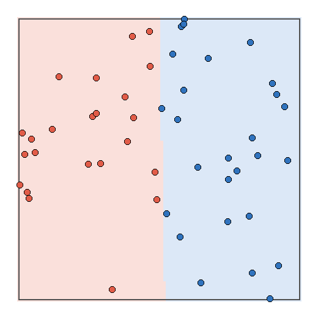
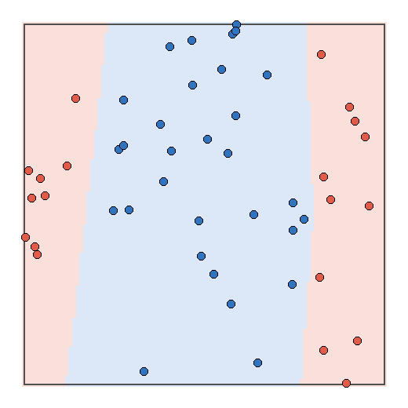
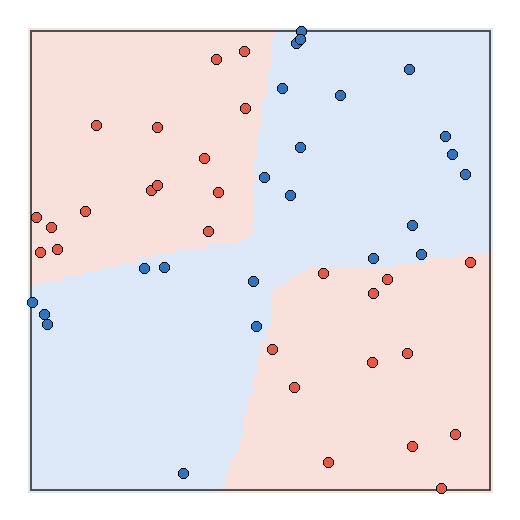

# MiniTorch Module 3


* Docs: https://minitorch.github.io/

* Overview: https://minitorch.github.io/module3.html


You will need to modify `tensor_functions.py` slightly in this assignment.

* Tests:

```
python run_tests.py
```

* Note:

Several of the tests for this assignment will only run if you are on a GPU machine and will not
run on github's test infrastructure. Please follow the instructions to setup up a colab machine
to run these tests.

This assignment requires the following files from the previous assignments. You can get these by running

```bash
python sync_previous_module.py previous-module-dir current-module-dir
```

The files that will be synced are:

        minitorch/tensor_data.py minitorch/tensor_functions.py minitorch/tensor_ops.py minitorch/operators.py minitorch/scalar.py minitorch/scalar_functions.py minitorch/module.py minitorch/autodiff.py minitorch/module.py project/run_manual.py project/run_scalar.py project/run_tensor.py minitorch/operators.py minitorch/module.py minitorch/autodiff.py minitorch/tensor.py minitorch/datasets.py minitorch/testing.py minitorch/optim.py

## tasks 3.1–3.2

short version of the `python project/parallel_check.py` output:

```text
MAP
Parallel region 0:
+--3 (parallel)
   +--0 (serial)
   +--1 (serial)

ZIP
Parallel region 0:
+--8 (parallel)
   +--4 (serial)
   +--5 (serial)
   +--6 (serial)

REDUCE
Parallel region 0:
+--11 (parallel)
   +--9 (serial)
   +--10 (serial)

MATRIX MULTIPLY
Parallel structure is already optimal.
```

so the outer loops are parallel and numba says the matmul structure is already optimal.

tasks 3.3–3.4: skipped for now.

## task 3.5

ran this on cpu fastops with 50 points, 10 hidden units, rate 0.5 and 500 epochs.
the numba warm-up isn't included in the timing.

```text
Simple  loss=0.931503  correct=50/50  0.02641 sec/epoch
Split   loss=0.041607  correct=50/50  0.02494 sec/epoch
XOR     loss=1.574249  correct=50/50  0.02675 sec/epoch
```





also tried a bigger model on split: 100 hidden units, rate 0.05 and 500 epochs.
it got 50/50 with loss 1.149955 and took 0.05621 sec/epoch.
